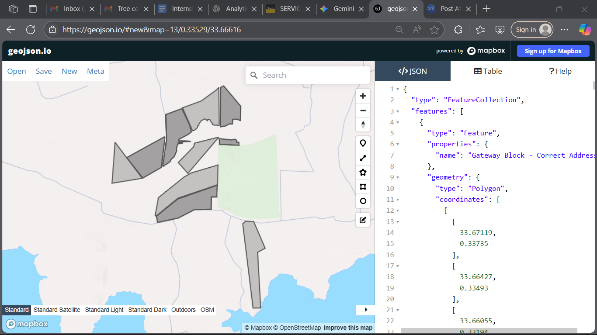
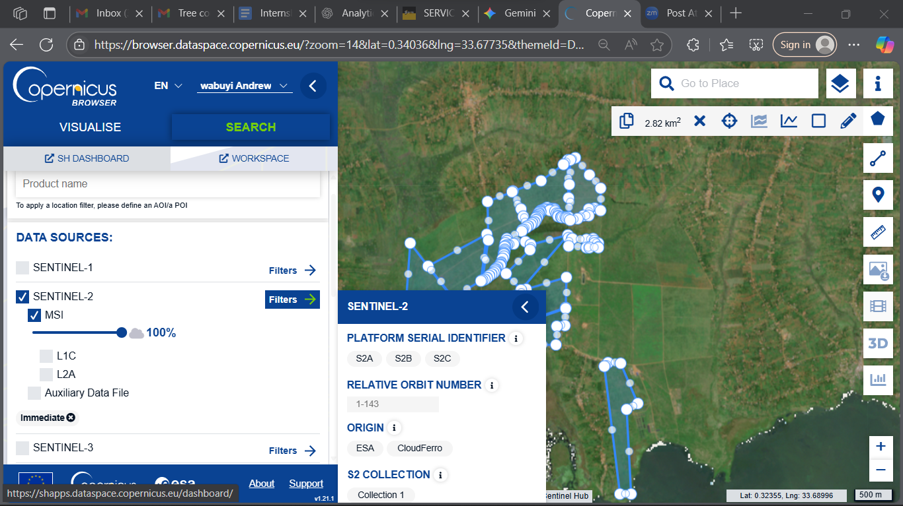
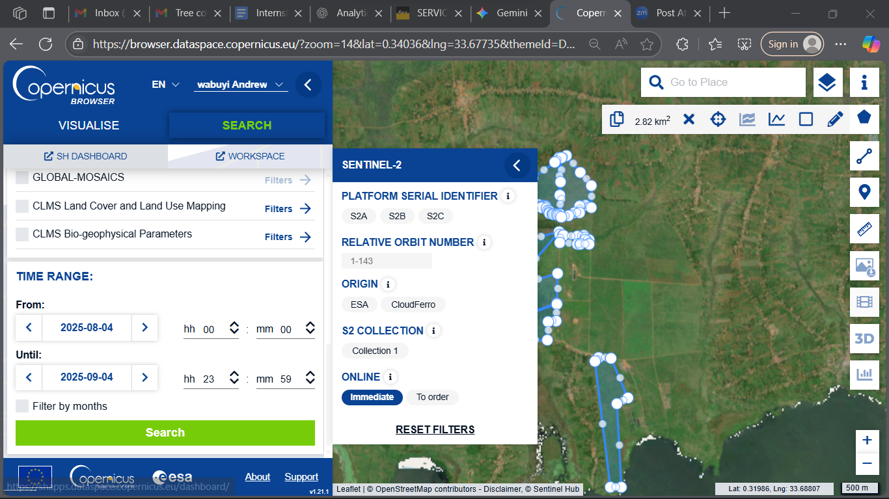
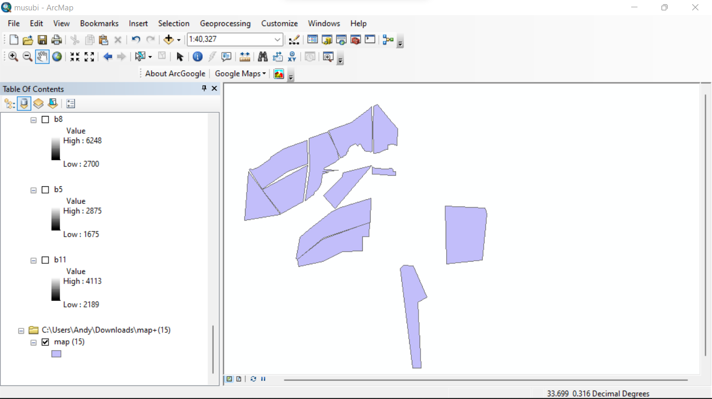
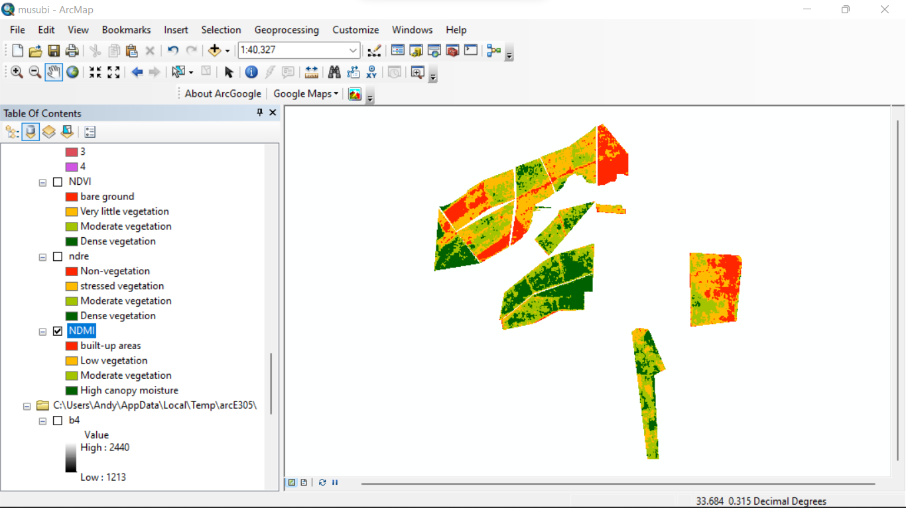
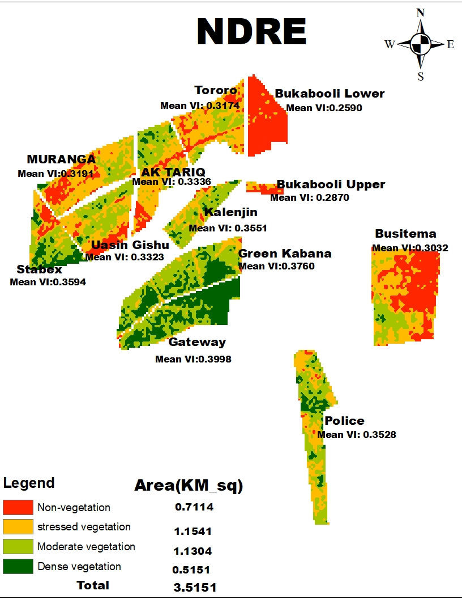
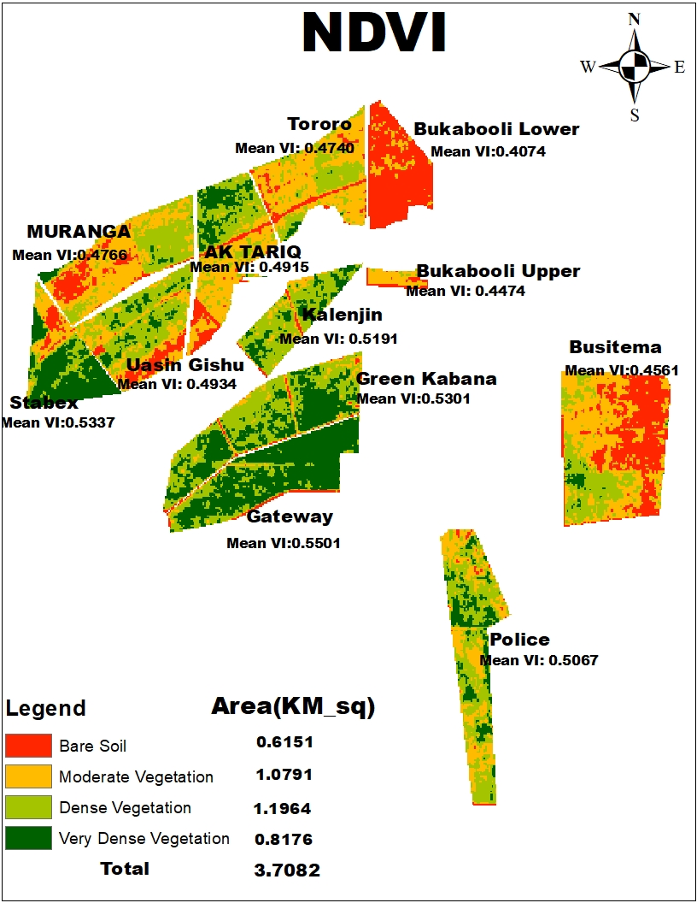

# Geospatial Project: Sentinel-2 Satellite Imagery Analysis for Vegetation & Soil Health Mapping 🛰️

This project implements a complete workflow for **Geographic Information Systems (GIS) mapping** and **satellite remote sensing analysis**. Using **Sentinel-2** data, the objective was to assess vegetation health, soil moisture, crop stress, and **Above Ground Carbon (AGC) sequestration** within a defined Area of Interest (AOI).

The repository documents the data acquisition, processing, and visualization methodology, with a focus on the **Python scripts** used for index calculation and statistical analysis.

---

## 💻 Technical Stack & Key Technologies

| Category | Tools & Technologies Used |
| :--- | :--- |
| **GIS Software** | ArcMap (Primary Processing), ArcGIS Pro (Alternative), QGIS (FOSS) |
| **Satellite Data** | Sentinel-2 (ESA Copernicus L2A), Landsat, GeoJSON, Shapefile |
| **Data Acquisition** | Copernicus Open Access Hub (SciHub) |
| **Scripting & Automation** | **Python** (for **Automated Raster Calculation**, Zonal Statistics, and Post-processing) |
| **File Formats** | .SAFE (Sentinel-2), .shp (Shapefile), .geojson, .dbf (dBASE) |

---

## ✨ Project Highlights & Key Deliverables

* **Geospatial Data Handling:** Demonstrated proficiency in converting vector data ($\text{GeoJSON} \rightarrow \text{Shapefile}$), handling large **.SAFE** raster files, and managing projections.
* **Automated Raster Index Derivation:** Successfully calculated and mapped multiple critical indices using **Python Scripts** (not manual Raster Calculator input). The key formulas used are:
    * **Normalized Difference Vegetation Index ($\text{NDVI}$):** $(\text{B8} - \text{B4}) / (\text{B8} + \text{B4})$
    * **Normalized Difference Moisture Index ($\text{NDMI}$):** $(\text{B8} - \text{B11}) / (\text{B8} + \text{B11})$
    * **Normalized Difference Red Edge ($\text{NDRE}$):** $(\text{B8A} - \text{B4}) / (\text{B8A} + \text{B4})$
* **Advanced Thematic Analysis:**
    * **Above Ground Carbon (AGC):** Derived a proxy for AGC using a regression model based on one of the spectral indices.
    * **Zonal Statistics:** Calculated the **Mean Value of each index** (NDVI, NDMI, etc.) per classified land cover zone.
* **Statistical Deliverables:** Performed **raster reclassification** and **raster-to-polygon conversion** to calculate area ($\text{ha}$) and **mean index values** per class, summarized in Excel ($\text{Pivot Tables}$).

---

## 📈 Detailed Workflow: Data Processing Steps

This section outlines the primary steps executed during the internship, emphasizing the role of Python for complex geospatial operations.

### 1. Data Acquisition & Preparation

1.  **AOI Definition:** Obtained $\text{GeoJSON}$ boundary and converted it to $\text{Shapefile}$ ($\text{.shp}$) format.
    
2.  **Imagery Search:** Used the **Copernicus Open Access Hub** to filter and download **Sentinel-2 L2A** products, ensuring low cloud cover and a specific time range.
    
    
3.  **Band Selection:** Selected and harmonized 10m resolution bands ($\text{B2, B3, B4, B8}$) and resampled 20m bands ($\text{B8A, B11}$) to a consistent 10m resolution.

### 2. GIS Processing & Analysis (Python & ArcMap)

1.  **Data Clipping:** Applied the $\text{AOI Shapefile}$ to clip the raw Sentinel-2 imagery.
    
2.  **Automated Index Calculation (Python):** Instead of manual use, **Python scripts** were used to batch process and generate the $\text{NDVI}$, $\text{NDMI}$, $\text{NDRE}$, and **AGC** raster layers.
3.  **Classification & Visualization:** **Reclassified** the index layers into meaningful classes and applied relevant **color ramps** for intuitive display.
    
4.  **Statistical Analysis (Zonal Statistics):** Converted the classified raster maps to $\text{Polygon Shapefiles}$. This step included calculating:
    * **Area** (in hectares) using $\text{Geometry Calculation}$.
    * **Mean Index Value** of the underlying $\text{NDVI}$/$\text{NDMI}$ raster for each classified polygon/zone.
    
    The resulting attribute table was exported to Excel for $\text{Pivot Tables}$ and statistical summary.

### 3. Final Output & Documentation

1.  **Map Layout:** Designed **map layouts** (including title, legend, scale, north arrow) and exported high-quality $\text{PNG/JPEG}$ maps for reporting.
    
    

---

## 📚 Learning & Conclusion

As a Computer Engineer, this project was a valuable introduction to the complexities of **geospatial data**, remote sensing principles, and the application of **scripting for geospatial automation**. The primary challenges involved managing large data volumes, overcoming **cloud cover challenges**, and mastering the specialized $\text{GIS}$ environment and **Python libraries for raster processing**.
**The challenge am still facing is having the accurate visualization in referance to what is on Ground as you can see above the results are not accurate incase of any suggestion i do welcome it**.